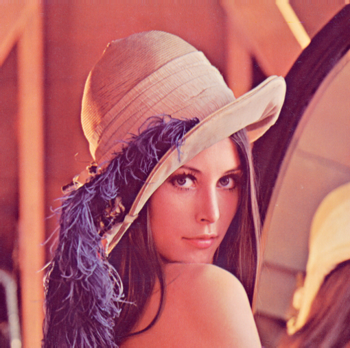
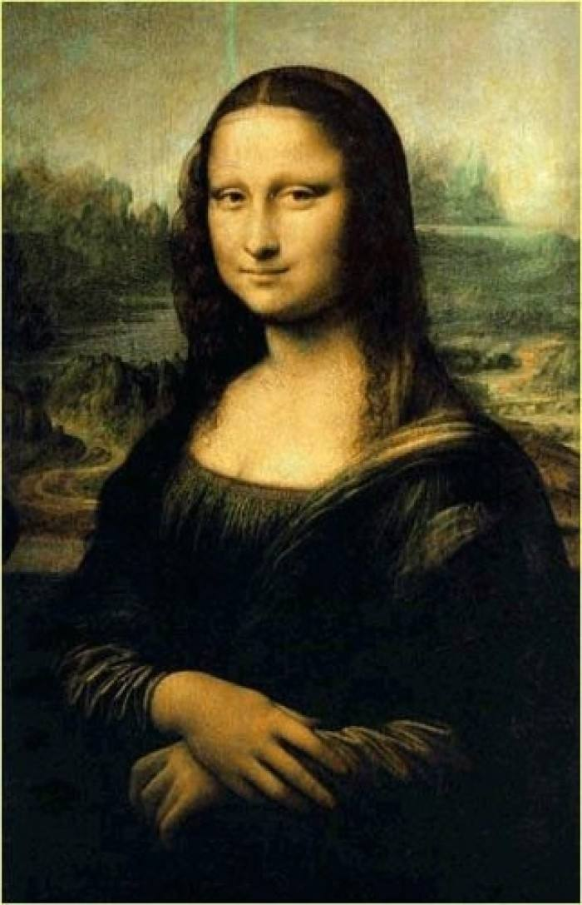
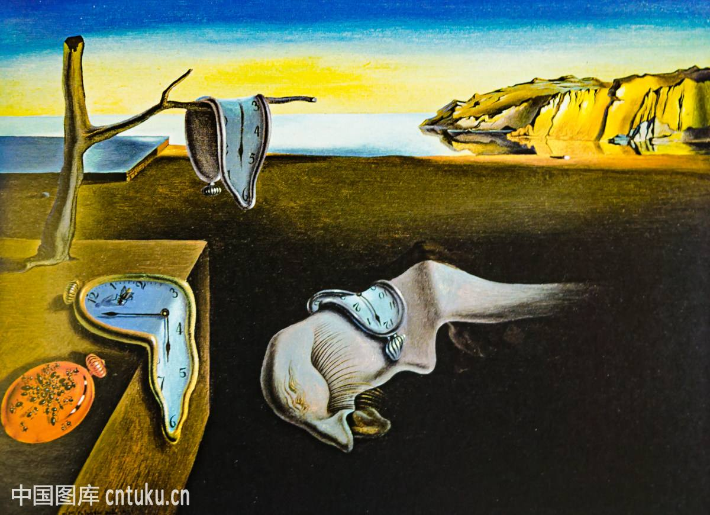
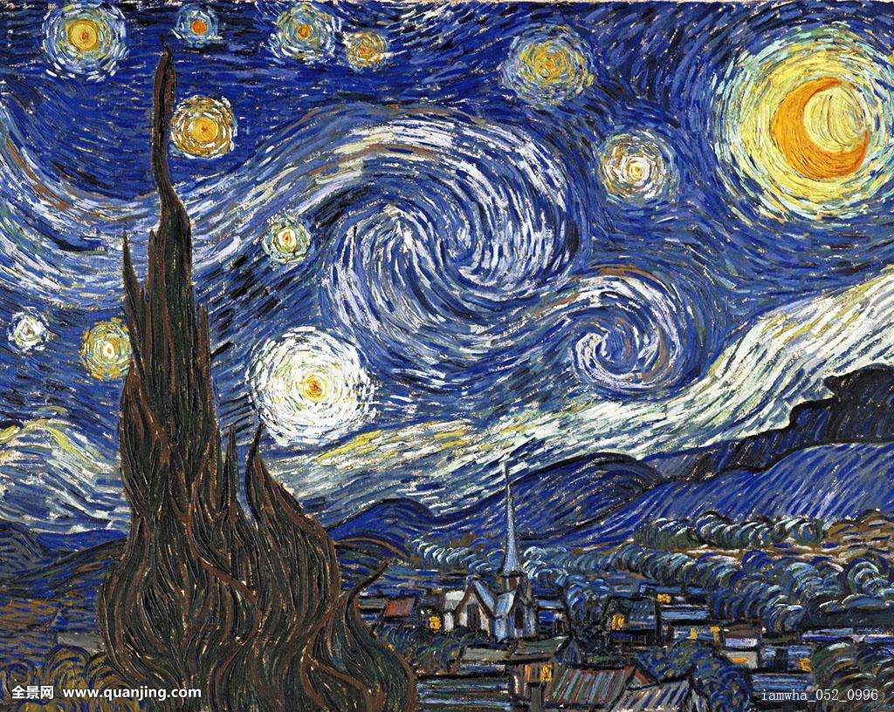
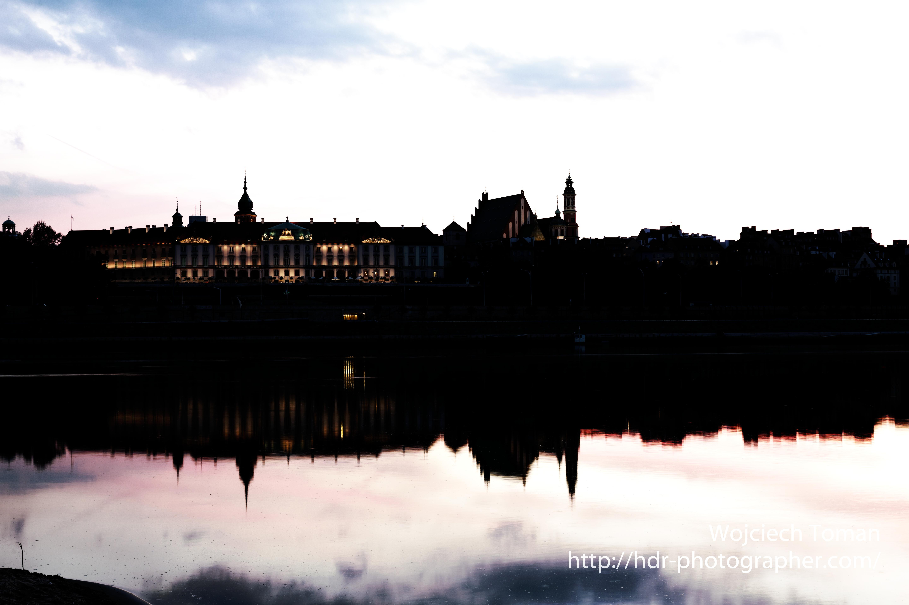
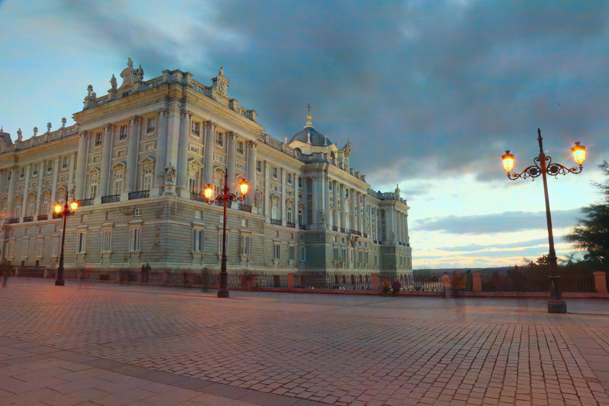
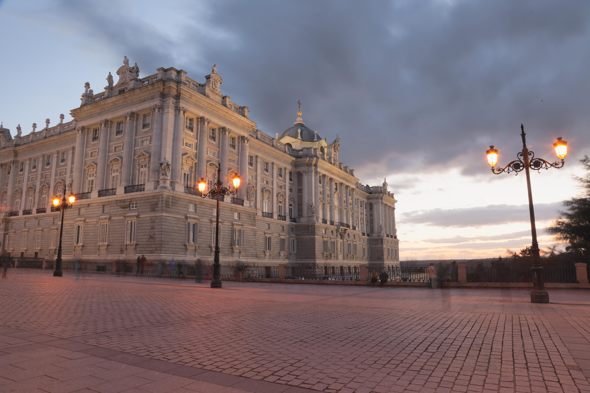

# Image Fusion

这次Porject主要想要实现图片的融合技术, 单纯对RGB三通道进行加权融合肯定效果不大好，如果能利用DCT技术进行融合的话也许能将想要的特征提取出来并合并。

## Artistic Style

事实上，最初我计划让不同图片之间相互融合，特别是图片和名画之间的融合，主要思想是在DCT不同的区域设下不同的权重，比如希望能捕捉名画的笔触，那么会给名画的中高频区域的比重加大，希望能保留图片原有的样子，于是将低频区域把图片的比重加大，希望能让图片整体色调趋向名画，所以直流信号在名画部分取更大的比例。

但事实上无论如何调整参数，效果不尽如人意。

首先这是我使用的原图：




----

Lana 和 Mona Lisa 之间的混合

<center class="half">


</center>

---

Lena 和 达利的想象
<center class="half">


</center>


---

Lena 和 星空
<center class="half">


</center>

---

于是，我在思考是否能让图片自己和自己融合，从而增强其画质，经过查找发现了HDR技术。

## HDR

这个部分主要看的文献是Paul Debevec 等人的 paper "Recovering High Dynamic Range Radiance Maps from Photographs"[^1]， 而且`gslove.m` 也是原论文给出的算法的小改版。以下简述一下论文

hdr的原理是假设实际光是 $E_j$ ，那么受到曝光时间$t_i$影响，相机实际接受到的是 $E_j \Delta t_i$ , 由于每个相机对接受到的光转化不一样, 所以最终的结果是 
$$
Z_{ij} = f(E_j\Delta t_i).
$$
那么很容易算出原来的光线值
$$
E_j = f^{-1}(Z_{ij}) / \Delta t_i.
$$
为了让这个式子线性，两边取对数, 同时记 $lnf^{-1}()$ 为$g()$
$$
lnE_j = g(Z_{ij}) - lnt_i.
$$
为了让这个式子在所有曝光和像素点处成立，
$$
0 = \sum^n_j \sum^p_i(Z_{ij}  - lnt_i - lnE_i)^2 + \lambda \sum^{Z_{max}}_{z=Z_{min}+1}g''(z).
$$
最后一项是希望$g()$二阶导数，即凹凸性趋于0， 那么g就会更加平滑了，$\lambda$是一个参数，我理解为对g不平滑的惩罚力度。

通常来说，当相机看到的像素在0或者255附近的时候往往已经超过了相机的感受能力了，这些数据不可靠，所以我们简单的乘上一个两边是0，中间是128的三角形的权重函数。
$$
Zmid = \frac12(Z_{max}+Z_{min}),\\
w(z) = 
\begin{cases}
z - Z_{min}, \qquad z < Z_{mid}, \\
Z_{max} - z, \qquad z > Z_{mid}.
\end{cases}\\
0 = \sum^n_j \sum^p_i[w(Z_{ij})(Z_{ij}  - lnt_i - lnE_i)]^2 + \lambda \sum^{Z_{max}}_{z=Z_{min}+1}w(z)g''(z).
$$
这个方程可以把前后两个分开来堆在一个矩阵里:以下是矩阵一部分的示意，第一块是$Z_{ij}$ 所有的取值， 第二块是实际的光线，第三块是快门时间，最后两行是想要用于平滑的参数
$$
\left(\begin{array}{cccc|ccc|c}
Z_{ij}=3 &Z_{ij}=4& Z_{ij}=5&Z_{ij}=6& .& .&.& .\\
w_{3}g(3) &.& .&.& -w_{3}E_1 & .&.& -w_{3}\Delta t_1\\
. & w_{4}g{(4)} & .&.&-w_{4}E_1 & .&.&-w_{4}\Delta t_2\\
.&.&w_{5}g{(5)}&.&.&  -w_{5}E_2 &.&-w_{5}\Delta t_1\\
. & w_{4}g{(4)} & .&.& .& .&-w_{4}E_i & -w_{4}\Delta t_j\\
.&.&.&.&.&.&.&.\\
\lambda w_4g{(3)} & -2*\lambda w_4g{(4)}&\lambda w_4g{(5)}&.&.&.&.&.\\
.&\lambda w_5g{(4)} & -2*\lambda w_5g{(5)}&\lambda w_5g{(6)}&.&.&.&.
\end{array}
\right) = 0
$$
接下来把变量分离出来
$$
A x = b \\
\left(\begin{array}{cccc|ccc}
w_{3} &.& .&.& -w_{3} & .&.& -w_{3}\\
. & w_{4} & .&.&-w_{4} & .&.&-w_{4}\\
.&.&w_{5}&.&.&  -w_{5} &.&-w_{5}\\
. & w_{4} & .&.& .& .&-w_{4} & -w_{4}\\
.&.&.&.&.&.&.&.\\
\lambda w_4 & -2*\lambda w_4&\lambda w_4&.&.&.&.&.\\
.&\lambda w_5 & -2*\lambda w_5&\lambda w_5&.&.&.&.
\end{array}
\right) * 
\left(\begin{array}{}
...\\ g{(3)}\\ g{(4)}\\ ... \\ g{(255)}\\ E_1\\E_2\\...
\end{array}
\right) = 
\left(\begin{array}{}
...\\ w_{3}\Delta t_1\\ w_{4}\Delta t_2\\ ... \\ 0\\ 0\\0\\...
\end{array}
\right)
$$
所以这个超定方程可以用 $MATLAB$ 奇异值分解的方法算出来

```matlab
% SVD
x = A \ b;
```


## 曝光时间预测

首先一个问题是曝光时间我们不一定知道(在实验中，MATLAB出于不知道什么原因无法获取曝光信息)，所以我们需要一个算法去估算曝光时间。在我对算法的理解中，曝光时间的具体数值不重要，重要的是他们之间有一定的差距，只需要估算的曝光时间大致趋势和真实差不多即可。首先我们先对图片采样然后做Lab变换获得亮度图层，对亮度图层做DCT变换，直流信号就是全局的光照强度。推算曝光时间可以用以下公式:

$$
\hat{E_i} = ((\frac{D_i - D_{min}}{D_{max} - D_{max}} ) ^{Exponent} + \alpha)  \times \beta\frac{B_{max}}{B_{min}}.
$$

$\hat{E_i}$ 是对第 $i$ 张光照的预测，$D_i$ 是第 $i$张图片的亮度的直流信息， $D_{min}$ 和$D_{max}$是直流信息的最大值。$Exponent$ , $\alpha$, $\beta$ 是可供调整的参数，实验中分别取2, 1 / 50， 1.8. 这个公式先将 $D_i$ 线性投射到 $[0, 1]$ 区间上, 接着通过 $Exponent$ 次方让数据向原点集中,  $\alpha$ 为了保证最低曝光不是0, 最后乘上最大值和最小值的比例作为系数，从而使算出来的曝光能随着直流系数改变而变动，最后 $\beta$ 是对这个系数的放大。实验中没有选取参数是其完全符合实际曝光为了防止过拟合。同时，值得注意的是，如果是一张黑纸的照片，很可能会被误认为低曝光，时间都集中在一个很小的区域。


## 亮度重建


首先我们需要重建出亮度层，事实上我尝试直接使用美国电影艺术与科学学会（颁布奥斯卡奖的那个），他们使用了一种叫 `Academy Color Encoding System`, 其中有人在[博客](https://knarkowicz.wordpress.com/2016/01/06/aces-filmic-tone-mapping-curve/)上给出了一个magic numbers， 换算公式如下:
$$
C_i = C_i \odot L_{adjusted},\\
C_i = \frac{C_i \odot (A \times C_i + B)}{C_i \odot (C \times C_i + D) + E}, \tag{[L.1]}\\ 
where\ A=2.51,B=0.03,C=2.43,D=0.59, E=0.14.
$$
$C_i$ 是指第i层的颜色， $L_{adjusted}$是经过调整的亮度, $\odot$ 是 element wise 的乘积。



因为是针对游戏渲染的，用在图片上效果惨不忍睹。 所以我不得不另辟蹊径，使用其他Tone mapping的办法。

首先亮度重建就是更具这个简单的公式:
$$
\begin{equation}
L = 0.2125 * R_{hdr} + 0.7154 * G_{hdr} + 0.0721 * B_{hdr}
\end{equation}. \tag{[L.2]}
$$
$R_{hdr},G_{hdr}, B_{hdr}$分别代表三色经过hdr后的值。 L是亮度， 但是亮度实际上要进行调整，使用的是`Reinhald`方法
$$
Key = exp(\frac{\sum_{i=0}^{w}\sum_{j=0}^{h}log(L_{ij} + \delta)}{w \times h}),\\
L_{ij}' = \frac{L \times \gamma}{Key}.
$$
这里Key是整个图像的几何平均， $\gamma$ 是一个参数，用于人工调节亮度，实验中取0.9。$\delta$ 是一个参数防止$log0$的情况出现。接下来再用公式$[L.1]$继续修正亮度值，最后将亮度乘以100到`CIE Lab`的范围内。

 其实还有更加简单的重建方法可以快速将hdr映射到$[0,1]$ 区间内:
$$
L_{ij} = \frac{L_{ij}}{1+L_{ij}}.
$$


色彩重建是基于原图而不是 hdr 的方法重建的。就是直接在图片上提取颜色信息，进行选择或按比例混合。

## 色彩重建

### 正态分布法

正态分布法是因为不同曝光的图片对色彩信息的保留程度不同，最浓厚的色彩，整体的色调往往在低曝光和中等曝光处，而一些比较高频的色彩可能需要更长的曝光时间才能在图片里显示出来，正态分布法是希望以正态分布的方法取各自曝光所擅长的领域。

因为信号集中在低频，特别时jpeg是做过量化以后，所以会希望大部分采样点设置在低频区域，
$$
Scaler_i = (\frac{B_i - B_{min}}{B_{max} - B_min})^{exponent}, \\
(x_i, y_i) =Scaler_i * (w, h).
$$
$Scaler$ 是一个缩放引子，$exponent$越大采样点会向原点集中。$(x_i, y_i)$ 是采样点坐标，$(w, h)$ 分别是图片的宽和高。
$$
X \sim N(\mu, \sigma ^ 2),\  f(x) = P(X=x),\\
C_{xy} = \sum_{i=0}^{b} (f(x_c - x_i)+f(y_c-y_i)) \times C_{xy}^i.
$$
其中 $C_{xy}^i$是第i张照片位于$x_c, y_c$的值，$x_c,y_c$ 分别是其的位置，$b$是图片数量。

在实验过程中，往往认为曝光适中的照片颜色是最可信的，而且希望最终采样结果权重之和是1，所以会单独取出一张图片用来补偿所以采样权重之和不是1的区域。


### 最大值法

作为一张HDR图片, 亮度是足够了，但是感觉动态范围不够宽，颜色还是有些暗淡， 所以尝试一种新的解决办法: 既然正态分布采样无法符合要求, 那么最粗暴的方法是提取颜色最大值, 从而获得图片颜色饱和度的提升。因为Lab色彩模式有正负，所以取的是离原点最远的。如果直接这样做，天空的颜色会变成橙色。


> hdr_tanh_maxColor.jpg: 直接取颜色最大值的后果

为了丑陋的颜色, 首先对原因分析,很可能是因为全局的颜色有偏差。对图像先做DCT变化,在直流区域取平均值, 交流区域取最大，得到如下结果，神奇的事情在于，天空的颜色变了。这样的天空虽然和实际差别有点大，但是好处在于，它把整张图片颜色对比强调出来了，这种算法也许可以用来调节画面颜色过于单调。



> hdr_tanh_maxDCTColor.jpg:直流信号平均采样后的图片
<center class="half">


</center>

> 左: 原图， 右： 颜色直流信号平均采样后的hdr图片，

如上图，测试这个方法在别的图像上的表现，发现这个方法会产生统一风格的图片，会对蓝色和红色进行强调。

### DCT 最大信号

这个方法的直觉是一张图片经过DCT变换，如果它非0系数越多说明保存的信号可能会越丰富。为了让他们的权重不一样，即DCT所以采用的是指数平均:
$$
v_{ij}^e = (1-\beta)v_{ij}^{e-1} +\beta D_{ij}^e, \quad v_{ij}^0 = 0,\\
s.t. ||D^{e+1}||_0 > ||D^{e}||_0 , \ 1<e<numexps,\\
D_{ij}' = v_{ij}^{numexps}.
$$
$v_{ij}^{e-1}$ 是记录前e次的加权平均,初值为0, $D_{ij}^{e}$ 是DCT信号矩阵$L_0$范数倒数第$e$大的那一张, $\beta$ 是一个参数，实验中取的是0.8, $numexps$ 是指总的曝光数。 最终的结果就是$v_{ij}^e$的$e$ 取到最大情况。

如果这样子做的话实际上强化了噪声，在视觉整体来看和正态分布法差异不大，但是会有很强的噪点, 但是这些噪点不同于普通的噪点在于其有一种水彩画没有涂抹均匀,坑坑洼洼的感觉:

<center class="half">


</center>

> 使用DCT 最大信号采样和放大后的图片


### 色彩增强

如果直接从原图提取颜色, 发现色彩并不鲜艳，于是希望色彩能有所增强。一开始用三角形取过滤，希望它能在中间亮度区域提高饱和度。具体是把亮度矩阵经过三角滤波，公式如下:

$$
S_i = f(\frac{L_i}{L_{max}} \times T_{inmax}) / (T_{outmax}  *  Strength) + 1.
$$

$T_{inmax}$ 是输入的最大值，$T_{outmax}$ 是输出最大值， $ Strength $是一个参数, 用于调整饱和度提升的强度, f是三角滤波。$S_{ij}$ 是对应像素的饱和度提升权重。

但实际效果不理想，发现真正需要增强的是高光区域，于是使用将 $f$ 用 $sigmoid$ 公式调整如下:

$$
S_{ij} =\sigma (\frac{L_{ij}}{L_{max}} \times w - \frac{w}{2}) / (T_{outmax}  *  Strength) + 1.
$$

$ w $ 是希望利用的 $sigmoid$ 的长度。 由于MATLAB没有此函数，所以用$tanh$ 代替。

最终效果如下:



> hdr_saturation_with_tanh.jpg: 使用tanh对饱和度进行调整
<div>

## 总结

这次实验学会了hdr技术，同时能利用hdr配合不同的色彩采样方式获得不同的效果，利用DCT这个工具派生出了3种不同的色彩采样方式，能基本地把颜色还原出来，但是和实际人工手动PS的图片还是有不少差距。不足之处在于很多做法完全出于直觉，并非严格的公式推导，以至于总是出现意想不到的效果。


[^1]: Paul E. Debevec Jitendra Malik, Recovering High Dynamic Range Radiance Maps from Photographs In SIGGRAPH '97 (1997)


