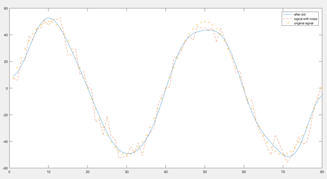
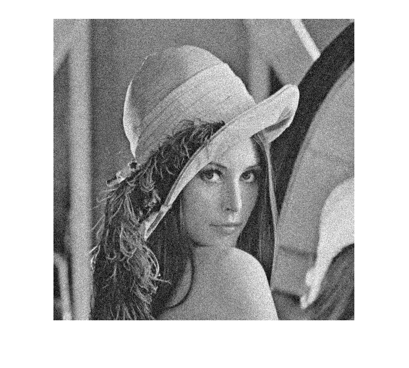
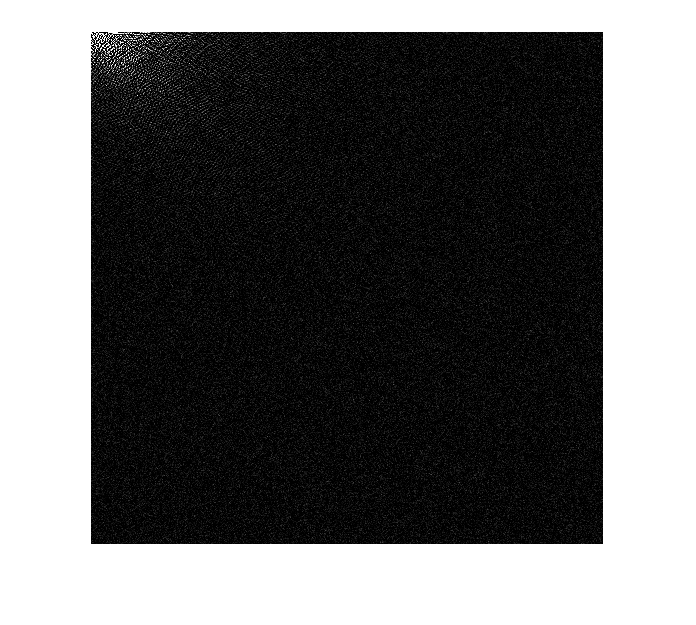
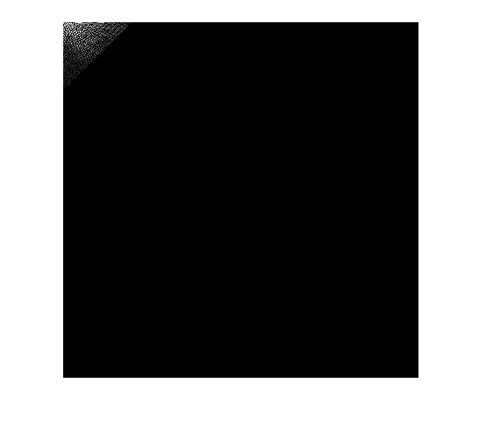
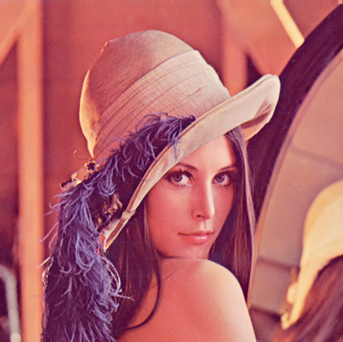
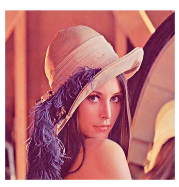

# Digital Signal Processing

This is repo for Digital Signal Processing Course at ZJU. The projects covers PCM, FFT, DWT, DCT, and image compression. All projects are written in Matlab. It is recommended to use Matlab 2019 or above.

## 0. Project

HDR Image Fusion.

source code [here](./artistic)

Report in [chinese](./upload/DigitalSignal.pdf), translation on the way.

## 1. Differential Encoding

source code [here](./pcm/)

It supports lossless differential encoding and discrete (lossy one) encoding.

## 2. 1D DCT (Discrete Cosine Transform)

source code [here](./dct/)

results:

> Recovered from lossy DCT

## 3. 2D DCT for denoising

source code [here](./dct2/)

results:

| Image With Noise                                             | Denoised Image                                               |
| ------------------------------------------------------------ | ------------------------------------------------------------ |
|  |  |
| **DCT of Noisy Image**                                       | **DCT of Denoised Image**                                    |
|    |  |

## 4. "JPEG" Compression

source code [here](./imgcom/)

It compress images, save it to file and read from file. It basically follow the routine of JPEG Compression: 

1. Color downsample
2. DCT on 8\*8 block
3. DC Signal is compressed with differential encoding
4. AC Signal is expanded in zigzag manner, and is encoded with RLE.
5. All data is compressed with entropy encoding (Huffmann) 

Then it saves meta data and the result to file. Under some extreme cases it works better than JPEG (possibly due to simple image format).

result:

| Original Image 761kB bmp                                     | Compressed Image 29kB “jpeg” (screenshot)                    |
| ------------------------------------------------------------ | ------------------------------------------------------------ |
|  |  |

Note that the resulting image is postfixed with “.leon” and cannot be opened by any image viewer (except mine of course). 

The resulting image file is 3.8% the size of original one. 

## 5. DFT (Discrete Fourier Transform)

source code [here](./fft/)

## 6. DWT

source code [here](./dwt)

